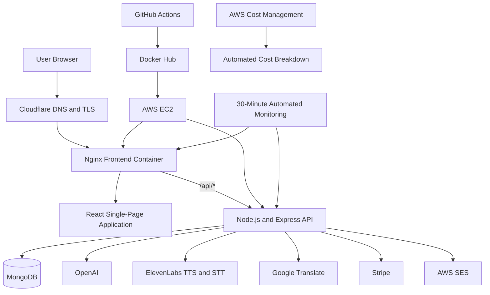
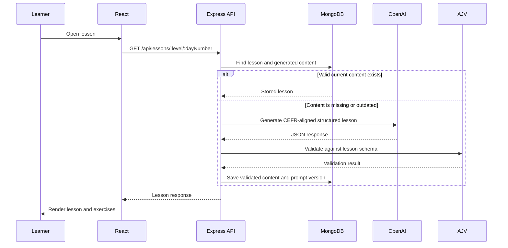

LPT & CO. | WE'RE HIRING
AI BUILDER & APPRENTICE
We show up. Bring what you've made and how fast you learn. We'll teach you the rest.
Contract-to-Permanent • Cornwall, Ontario • Full-Time, In-Office • 50,000-70,00$
ABOUT LPT & CO.
LPT & Co. is a boutique consulting and AI products firm in Cornwall, Ontario. We help founders,
municipalities, Indigenous organisations, and non-profit teams across Eastern Ontario through hands-on
consulting, loan administration, and governance support. We also build the AI-powered products that
are fast becoming the bigger part of what we do: Mezzura™, our lending intelligence platform; Second
Cut™, our community data practice; and North Clearing™, our fractional COO and embedded operations
practice. We don't advise from a distance. We get in the trenches and build the structure, and the tools,
that keep the work moving. We're a small, close-knit crew, which means everyone wears several hats,
works shoulder to shoulder with clients and Principals, and sees the real impact of their work every day.
THE OPPORTUNITY
This one is different, and we mean it. We're looking for a builder: someone who makes things, breaks
things, fixes them, and can't help tinkering. You might be self-taught. You might have a degree in
something unrelated. You might have spent the last two years building bots, automations, side projects,
a physical thing in a workshop, or small businesses on your own. We care far more about what you can
make and how fast you learn than about the line items on your resume.
You'll work alongside the Principals to build real things: internal tools, automations, and the technical
backbone behind our analytical and product work, from data pipelines and classification tools to
dashboards, proofs of concept, and the AI-powered products that are central to where the firm is
headed, like Mezzura (our lending intelligence platform) and Second Cut (our community data practice).
These products are how we expect the business to grow, so what you build here matters. You'll be
mentored, you'll be stretched, and you'll ship work that counts from early on. This is a contract to start,
with a clear path to permanent for someone who proves they can build.
WHAT YOU'LL DO
This is the range of building work on our plate. You won't own all of it; we'll weight it toward your
strengths.
BUILD & PROTOTYPE
• Make things that work: build internal tools, automations, scripts, dashboards, and small apps that
take real work off the team's plate, and improve them as you learn what actually helps.
• Product features and proofs of concept: contribute to our AI products (Mezzura, Second Cut)
and stand up prototypes and dashboards for internal and client projects.
DATA & AUTOMATION
• Data tooling at scale: help build and maintain the data and classification tooling behind our labour
market work, including the scripts and pipelines that keep it running.
• Accuracy and QA: run quality checks on our data and outputs, catch what's wrong, and document
it so the results can be trusted.
WEB & SEO
• Build and improve our sites: help build, fix, and optimize our product and marketing sites,
including search and performance.
WORK WITH AI
• Build with AI tools: use AI to design, draft, code, and ship faster, with the judgment to know when
the output is good and when it isn't.
LEARN THE BUSINESS
• Understand the why: learn how consulting, lending, and data work actually happen here, so the
things you build solve the real problem and not just the obvious one.
SHIP, IMPROVE & WORK WITH THE CREW
• Finish things: take an idea from rough to working to genuinely useful, then keep sharpening it. We
value shipped over perfect, and useful over clever.
• Be part of the team: share what you're building, ask good questions, take feedback well, and help
the people around you. A small firm only works when everyone pulls together.
WHO YOU ARE
You're a relentless learner and a genuinely hard worker. You don't wait for permission or perfect
instructions; you figure it out, try something, and iterate. You've almost certainly built things on your
own already, for the simple reason that you couldn't not.
You have integrity and good judgment, because you'll be trusted with real work and sometimes sensitive
information. You're humble enough to take feedback and confident enough to have a point of view. And
you actually want to be part of a crew: people who look out for each other and care about the work.
We're not interested in lone wolves passing through. We're interested in who you are.
WHAT YOU'LL BRING
We're deliberately not handing you a checklist of credentials. There's no required degree and no
required number of years. Instead, show us:
• Things you've built: anything, digital or physical. Code, an app, a bot, a data tool, or a spreadsheet
that runs a business, just as easily a machine, a piece of furniture, a rebuilt engine, a robotics project,
an event, a club, or a company. Evidence you make things.
• A fast learning curve: a track record of teaching yourself something hard and getting good at it.
• Curiosity about AI: you're already using these tools, or itching to, and you have instincts about
where they help.
• Drive and care: you work hard, you finish what you start, and you care about doing it well.
• Bonus, not required: any coding, scripting, data, or design skills you already have (Python, web,
automations, classification, and the like). If you don't have them yet but learn fast, that still counts.
If you read this and thought "that's me, but I'm not sure I'm qualified," apply anyway. That hesitation is
often exactly the person we're looking for.
DETAILS & HOW TO APPLY
• Term: contract to start, with a clear path to a permanent role for the right person.
• Location: LPT & Co. Office, Cornwall, Ontario. This is a full-time, 100% in-office role (not remote or
hybrid). We build best in the same room.
• Compensation: 50,000-70,00$, commensurate with experience and what you bring.
To apply, skip the formal cover letter if you want. Instead, send us one thing you've built, digital or
physical, with a few sentences on what it is, why you made it, and what you'd build next, to
hello@lptandco.com. Show us, don't just tell us. Applications are reviewed on a rolling basis until we
find the right person. help me apply to this job application based on

Worked for 1m 11s
Your strongest application angle
You are a strong match because LPT & Co. is not mainly looking for credentials; they want evidence that you build, learn quickly, troubleshoot, and finish useful products. They specifically ask applicants to send one thing they built, explain why they built it, and describe what they would build next. 


Submit LanglyAI as your main project. It demonstrates full-stack development, AI integration, databases, payments, authentication, cloud deployment, CI/CD, troubleshooting, and continuous improvement. Your resume already documents the platform’s 120+ lessons, OpenAI and speech integrations, REST APIs, AWS deployment, Docker, Stripe, and progress tracking. 


Application email
Subject: AI Builder & Apprentice Application – LanglyAI – Yashwant Bist

Hi LPT & Co. team,

I’m applying for the AI Builder & Apprentice position. The role immediately stood out to me because I enjoy taking an idea from a rough prototype to something people can actually use—and then troubleshooting and improving it when things break.

One thing I built is LanglyAI, an AI-powered language-learning platform designed to help learners progress through structured French lessons from A1 to B2.

Live application: https://langlyai.com
GitHub: https://github.com/yashwantbist/LanglyAI

I built the React and Node.js application, designed the MongoDB data models and REST APIs, integrated OpenAI, speech and translation tools, implemented JWT authentication and Stripe subscriptions, and deployed the application to AWS using Docker and GitHub Actions. Building it required me to teach myself production deployment, Nginx routing, Cloudflare configuration, AI-output validation, payment workflows, and systematic debugging.

I made LanglyAI because most language-learning tools either provide static lessons or unstructured chatbot conversations. I wanted to combine a structured learning path with AI-generated explanations, speaking practice, progress tracking, and personalized interaction.

What I would build next is an evaluation and feedback pipeline that checks generated lessons for CEFR-level alignment, formatting consistency, factual accuracy, duplication, and learner performance. The results would be displayed in an internal quality dashboard and used to improve future lesson generation.

Your emphasis on useful over clever, learning the underlying business problem, and working closely with a small team strongly matches how I want to grow. I completed my Computer Programming diploma at St. Lawrence College in Cornwall and would be excited to contribute in person to products such as Mezzura and Second Cut.

I’ve attached my resume and would welcome the opportunity to demonstrate LanglyAI and discuss how I approach building, troubleshooting, and learning.

Thank you,

Yashwant Bist
343-585-6585
yashwantbist19@gmail.com
LinkedIn: https://www.linkedin.com/in/yashwant-bist
Portfolio: https://yashwant-portfolio.com
GitHub: https://github.com/yashwantbist

Tailored resume summary
Replace your current opening with:

AI-focused full-stack developer and Computer Programming graduate with hands-on experience building, deploying, and improving practical AI products, internal workflows, dashboards, and web applications. Creator of LanglyAI, a production-deployed language-learning platform with 120+ structured lessons, AI-generated content, speech and translation integrations, authentication, progress tracking, subscriptions, and AWS/Docker deployment. Strong in React, Node.js, JavaScript, Python, MongoDB, REST APIs, AI integration, testing, CI/CD, and production troubleshooting. Fast learner who enjoys turning unclear problems into useful working tools.

Replace your LanglyAI bullets
LanglyAI – AI-Powered Language-Learning Platform
React, Node.js, Express, MongoDB, OpenAI, ElevenLabs, Stripe, AWS, Docker

Designed and built a full-stack AI learning platform supporting more than 120 structured lessons across A1–B2 levels, learner progress tracking, secure authentication, and subscription-based access.

Developed REST APIs and MongoDB models for lessons, users, subscriptions, payments, and completion progress.

Integrated OpenAI-generated lesson content, text-to-speech, speech-to-text, translation, and interactive speaking and writing exercises.

Added structured-output validation and content rules to improve the consistency and reliability of AI-generated lessons.

Containerized the frontend and backend with Docker and deployed them to AWS using GitHub Actions CI/CD, Nginx, Cloudflare, and production environment configuration.

Diagnosed and resolved production issues involving API routing, CORS, OAuth callbacks, Docker storage, Cloudflare connectivity, Stripe webhooks, and live payment configuration.

Important resume corrections
Remove percentage claims such as “improved engagement by 40%” or “increased efficiency by 35%” unless you have analytics or testing evidence to prove them. LPT emphasizes integrity and trustworthy outputs, so concrete technical evidence will be stronger than unsupported metrics.

Also correct:

OpenAPI → OpenAI API

MySql → MySQL

Github → GitHub

websocket → WebSockets

Use Projects rather than Experience for LanglyAI, HackRadar, and the car-rental platform.

Add a small Professional Experience section showing your hotel work, because it demonstrates responsibility, teamwork, client service, judgment, and handling sensitive information.

What to send
Attach a one-page tailored resume and include:

The LanglyAI live website.

The GitHub repository.

A 60–90 second screen-recorded demonstration.

A short README section called “What I would build next.”

In the video, briefly show the dashboard, one lesson, AI or speech functionality, progress tracking, and the production architecture. This directly follows LPT’s instruction to show what you have built rather than only describing it.


Application email

Subject: AI Builder & Apprentice Application – LanglyAI – Yashwant Bist

Hi LPT & Co. team,

I’m applying for the AI Builder & Apprentice position. The role immediately stood out to me because I enjoy taking an idea from a rough prototype to something people can actually use—and then troubleshooting and improving it when things break.

One thing I built is LanglyAI, an AI-powered language-learning platform designed to help learners progress through structured French lessons from A1 to B2.

Live application: https://langlyai.com
GitHub: https://github.com/yashwantbist/LanglyAI

I built the React and Node.js application, designed the MongoDB data models and REST APIs, integrated OpenAI, speech and translation tools, implemented JWT authentication and Stripe subscriptions, and deployed the application to AWS using Docker and GitHub Actions. Building it required me to teach myself production deployment, Nginx routing, Cloudflare configuration, AI-output validation, payment workflows, and systematic debugging.

I made LanglyAI because most language-learning tools either provide static lessons or unstructured chatbot conversations. I wanted to combine a structured learning path with AI-generated explanations, speaking practice, progress tracking, and personalized interaction.

What I would build next is an evaluation and feedback pipeline that checks generated lessons for CEFR-level alignment, formatting consistency, factual accuracy, duplication, and learner performance. The results would be displayed in an internal quality dashboard and used to improve future lesson generation.

Your emphasis on useful over clever, learning the underlying business problem, and working closely with a small team strongly matches how I want to grow. I completed my Computer Programming diploma at St. Lawrence College in Cornwall and would be excited to contribute in person to products such as Mezzura and Second Cut.

I’ve attached my resume and would welcome the opportunity to demonstrate LanglyAI and discuss how I approach building, troubleshooting, and learning.

Thank you,

Yashwant Bist
343-585-6585
yashwantbist19@gmail.com
LinkedIn: https://www.linkedin.com/in/yashwant-bist
Portfolio: https://yashwant-portfolio.com
GitHub: https://github.com/yashwantbist professsionalize and personalize it

Worked for 26s
Subject: Application – AI Builder & Apprentice | Yashwant Bist

Hi LPT & Co. team,

I’m excited to apply for the AI Builder & Apprentice position. Your emphasis on building useful things, learning quickly, and improving through iteration immediately resonated with me. I’m at my best when I can take an idea, turn it into a working product, troubleshoot what breaks, and continue refining it based on real needs.

One project I’m particularly proud of is LanglyAI, an AI-powered language-learning platform that helps learners progress through structured French lessons from A1 to B2.

Live application: https://langlyai.com
GitHub: https://github.com/yashwantbist/LanglyAI

I designed and built LanglyAI as a full-stack application using React, Node.js, Express, and MongoDB. I integrated OpenAI-powered learning content, speech and translation tools, JWT authentication, progress tracking, and Stripe subscriptions. I also containerized and deployed the application on AWS using Docker, GitHub Actions, Nginx, and Cloudflare.

The project pushed me beyond simply writing code. I had to teach myself cloud deployment, CI/CD, secure payment workflows, AI-output validation, production debugging, and how to turn a broad product idea into smaller features that could be built and tested. When something failed—from API routing and CORS to Docker configuration and Stripe webhooks—I investigated the problem, learned what I needed, and worked through it.

I created LanglyAI because I wanted to combine the structure of a traditional language course with the flexibility of AI-assisted learning. Rather than offering only static lessons or an open-ended chatbot, the platform provides a guided learning path with speaking practice, explanations, progress tracking, and interactive exercises.

The next feature I would build is an evaluation and quality-assurance pipeline that reviews generated lessons for CEFR alignment, consistency, duplication, accuracy, and learner performance. I would connect those results to an internal dashboard so weaknesses could be identified and future content could be improved systematically.

LPT & Co.’s approach of understanding the real business problem before building the solution is especially appealing to me. I would be excited to apply my skills to internal tools, data workflows, dashboards, and products such as Mezzura and Second Cut while learning directly from your team.

Cornwall is also personally meaningful to me. I completed my Computer Programming diploma at St. Lawrence College’s Cornwall campus and previously worked in the community. In addition to my technical background, my experience in hotel operations has strengthened my attention to detail, communication, judgment, and ability to handle sensitive information responsibly.

I’ve attached my resume and would appreciate the opportunity to demonstrate LanglyAI, discuss the decisions behind it, and learn more about the problems your team is working to solve.

Thank you for your consideration.

Best regards,
Yashwant Bist
343-585-6585
yashwantbist19@gmail.com
LinkedIn: https://www.linkedin.com/in/yashwant-bist
Portfolio: https://yashwant-portfolio.com
GitHub: https://github.com/yashwantbist

Your repository is public, but its current README contains only the project title and an image. Before applying, add a clear project overview, features, architecture, technology stack, deployment details, screenshots, and a “What I would build next” section. This will make the project much stronger when the hiring team opens the GitHub link.


Hi LPT & Co. team,I’m excited to apply for the AI Builder & Apprentice position. Your emphasis on building useful things, learning quickly, and improving through iteration immediately resonated with me. I’m at my best when I can take an idea, turn it into a working product, troubleshoot what breaks, and continue refining it based on real needs.One project I’m particularly proud of is LanglyAI, an AI-powered language-learning platform that helps learners progress through structured French lessons from A1 to B2.Live application: https://langlyai.com
GitHub: https://github.com/yashwantbist/LanglyAII designed and built LanglyAI as a full-stack application using React, Node.js, Express, and MongoDB. I integrated OpenAI-powered learning content, speech and translation tools, JWT authentication, progress tracking, and Stripe subscriptions. I also containerized and deployed the application on AWS using Docker, GitHub Actions, Nginx, and Cloudflare.The project pushed me beyond simply writing code. I had to teach myself cloud deployment, CI/CD, secure payment workflows, AI-output validation, production debugging, and how to turn a broad product idea into smaller features that could be built and tested. When something failed—from API routing and CORS to Docker configuration and Stripe webhooks—I investigated the problem, learned what I needed, and worked through it.I created LanglyAI because I wanted to combine the structure of a traditional language course with the flexibility of AI-assisted learning. Rather than offering only static lessons or an open-ended chatbot, the platform provides a guided learning path with speaking practice, explanations, progress tracking, and interactive exercises.The next feature I would build is an evaluation and quality-assurance pipeline that reviews generated lessons for CEFR alignment, consistency, duplication, accuracy, and learner performance. I would connect those results to an internal dashboard so weaknesses could be identified and future content could be improved systematically.LPT & Co.’s approach of understanding the real business problem before building the solution is especially appealing to me. I would be excited to apply my skills to internal tools, data workflows, dashboards, and products such as Mezzura and Second Cut while learning directly from your team.Cornwall is also personally meaningful to me. I completed my Computer Programming diploma at St. Lawrence College’s Cornwall campus and previously worked in the community. In addition to my technical background, my experience in hotel operations has strengthened my attention to detail, communication, judgment, and ability to handle sensitive information responsibly.I’ve attached my resume and would appreciate the opportunity to demonstrate LanglyAI, discuss the decisions behind it, and learn more about the problems your team is working to solve.Thank you for your consideration.Best regards,
Yashwant Bist
343-585-6585
yashwantbist19@gmail.com
LinkedIn: https://www.linkedin.com/in/yashwant-bist
Portfolio: https://yashwant-bist.netlify.app/
GitHub: https://github.com/yashwantbist tell them that i monitor every half an hour with automatic monitor system thru my email and amazon cost management tool for automatic cost break down

Subject: Application – AI Builder & Apprentice | Yashwant Bist

Hi LPT & Co. team,

I’m excited to apply for the AI Builder & Apprentice position. Your emphasis on building useful solutions, learning quickly, and improving through iteration immediately resonated with me. I’m at my best when I can take an idea, turn it into a working product, troubleshoot what breaks, and continue refining it based on real needs.

One project I’m particularly proud of is LanglyAI, an AI-powered language-learning platform that helps learners progress through structured French lessons from A1 to B2.

Live application: https://langlyai.com
GitHub: https://github.com/yashwantbist/LanglyAI

I designed and built LanglyAI as a full-stack application using React, Node.js, Express, and MongoDB. I integrated OpenAI-powered learning content, speech and translation tools, JWT authentication, progress tracking, and Stripe subscriptions. I also containerized and deployed the application on AWS using Docker, GitHub Actions, Nginx, and Cloudflare.

To support the application in production, I set up an automated monitoring system that checks the platform every 30 minutes and sends email notifications when an issue requires attention. I also use AWS Cost Management tools to monitor cloud usage and generate automated cost breakdowns, helping me understand where resources are being used and keep infrastructure spending under control.

The project pushed me beyond simply writing code. I had to teach myself cloud deployment, CI/CD, secure payment workflows, AI-output validation, production monitoring, cost management, and systematic debugging. When something failed—from API routing and CORS to Docker configuration and Stripe webhooks—I investigated the issue, learned what I needed, and worked through it.

I created LanglyAI because I wanted to combine the structure of a traditional language course with the flexibility of AI-assisted learning. Rather than offering only static lessons or an open-ended chatbot, the platform provides a guided learning path with speaking practice, explanations, progress tracking, and interactive exercises.

The next feature I would build is an evaluation and quality-assurance pipeline that reviews generated lessons for CEFR alignment, consistency, duplication, accuracy, and learner performance. I would connect the results to an internal dashboard so weaknesses could be identified and future content could be improved systematically.

LPT & Co.’s approach of understanding the real business problem before building the solution is especially appealing to me. I would be excited to apply my skills to internal tools, data workflows, dashboards, automations, and products such as Mezzura and Second Cut while learning directly from your team.

Cornwall is also personally meaningful to me. I completed my Computer Programming diploma at St. Lawrence College’s Cornwall campus and previously worked in the community. In addition to my technical background, my experience in hotel operations has strengthened my attention to detail, communication, judgment, and ability to handle sensitive information responsibly.

I’ve attached my resume and would appreciate the opportunity to demonstrate LanglyAI, discuss the decisions behind it, and learn more about the problems your team is working to solve.

Thank you for your consideration.

Best regards,
Yashwant Bist
343-585-6585
yashwantbist19@gmail.com
LinkedIn: https://www.linkedin.com/in/yashwant-bist
Portfolio: https://yashwant-bist.netlify.app/
GitHub: https://github.com/yashwantbist


yashwantbist/LanglyAI create a readme file for my langly ai with clean archtecture and what next going to be and tools used https://langlyai.com/

Worked for 4m 25s


Searched and fetched repo files for README update

Cloned LanglyAI repository and inspected structure


Fetched GitHub file contents for analysis

Searched the web and GitHub


Fetched package and handled workflows with plugins

Searched the web


Inspected architecture, routes, files, and fetched API content

Personalized LanglyAI purpose and reviewed deployment needs

Confirmed health check setup
I’m replacing the minimal README with a portfolio-ready version that documents the product, architecture, integrations, deployment pipeline, monitoring, setup, and roadmap.


Analysis paused
I created a polished, portfolio-ready README covering LanglyAI’s features, clean layered architecture, AI lesson-generation pipeline, tools, local setup, API structure, AWS deployment, CI/CD, 30-minute monitoring, cost management, and future roadmap. The content reflects the repository’s React/Express architecture, OpenAI and AJV lesson pipeline, Docker/Nginx deployment, and GitHub Actions workflows.

LanglyAI_README.md

I attempted to commit it directly to your main branch and also tried creating a documentation branch, but the connected GitHub integration returned 403: Resource not accessible by integration, so no repository changes were made.

To add it manually:

Open README.md in your LanglyAI repository.

Select the pencil icon to edit it.

Replace the current title-and-image-only content with the downloaded file and commit the change. Your existing README currently contains only the project heading and screenshot.


Library
/
LanglyAI_README.md


<div align="center">

# LanglyAI

### AI-powered French learning from A1 to B2

LanglyAI combines a structured CEFR-aligned curriculum with AI-generated explanations, bilingual examples, speaking practice, translation, progress tracking, and subscription-based access.

[](https://langlyai.com)
[](https://github.com/yashwantbist/LanglyAI/actions/workflows/deploy.yml)
[](https://github.com/yashwantbist/LanglyAI/actions/workflows/monitor.yml)

[Live Demo](https://langlyai.com) · [Report an Issue](https://github.com/yashwantbist/LanglyAI/issues) · [View Source](https://github.com/yashwantbist/LanglyAI)

</div>


---

## Overview

LanglyAI is a full-stack language-learning platform built to help learners progress through French levels **A1, A2, B1, and B2** using a guided curriculum rather than an unstructured chatbot experience.

The platform provides a **120-lesson learning path** with AI-generated bilingual content, examples, exercises, quizzes, speech features, translations, progress tracking, authentication, and paid subscription access.

The project was built as an end-to-end production application, including:

- Product design and frontend development
- REST API and database design
- AI content generation and validation
- Authentication and subscription management
- Third-party API integrations
- Docker containerization
- AWS cloud deployment
- CI/CD, health monitoring, and cloud-cost visibility

---

## Why I Built It

Many language-learning products fall into one of two categories:

1. Static lessons with limited personalization or interaction
2. Open-ended AI chat experiences without a structured learning path

LanglyAI combines the strengths of both. Learners follow a clear CEFR-aligned curriculum while receiving AI-generated explanations, bilingual examples, speaking support, exercises, and progress tracking.

---

## Core Features

### Structured French Curriculum

- 120 lessons across A1, A2, B1, and B2
- Daily lesson sequence with level-based navigation
- Protected access based on the learner's subscription plan
- Bilingual French and English learning content

### AI-Generated Lessons

- OpenAI-powered lesson generation
- CEFR-level prompting for appropriate vocabulary and complexity
- Structured explanations, key points, examples, exercises, quizzes, and tips
- JSON Schema output enforcement
- AJV validation before AI-generated content is saved
- Prompt versioning to support safe content regeneration

### Speech and Translation

- ElevenLabs text-to-speech for listening practice
- ElevenLabs speech-to-text for spoken responses
- Google Translate integration for contextual translation
- Audio processing through the backend to keep API credentials private

### Learner Progress

- Lesson completion tracking
- Score, accuracy, and time-spent fields
- Level-specific progress retrieval
- Persistent learner progress stored in MongoDB

### Authentication and Account Security

- Email and password registration
- Secure password hashing with bcrypt
- JWT-based authentication
- Google OAuth login
- Protected frontend routes
- Password reset emails through AWS SES
- Authenticated password-change workflow

### Subscription Management

- Stripe Checkout integration
- Stripe Customer Portal support
- Webhook-based subscription synchronization
- FREE, A1, A2, B1, and B2 access levels
- Subscription status and billing-period persistence
- Route-level entitlement checks

---

## System Architecture



### Request Flow

1. The user accesses `langlyai.com` through Cloudflare.
2. Nginx serves the compiled React application.
3. Requests beginning with `/api` are reverse-proxied to the Express backend.
4. The backend applies validation, authentication, subscription access rules, and business logic.
5. MongoDB stores users, lessons, progress, plans, and subscriptions.
6. External AI, voice, translation, payment, and email services are accessed only through the backend.

---

## Clean Architecture

LanglyAI currently uses a **modular layered architecture** within a full-stack monorepo.

### Presentation Layer

Located in `frontend/app/src`.

Responsibilities:

- React pages and reusable components
- Routing and protected routes
- Authentication state
- Lesson rendering
- User interactions and API requests

### API Layer

Located in `backend/routes`.

Responsibilities:

- HTTP endpoints
- Input handling
- Status codes and API responses
- Coordination between middleware, models, and external services

Primary route modules:

- `authroutes.js`
- `lessonroutes.js`
- `striperoutes.js`
- `voiceroutes.js`
- `translateroutes.js`

### Application and Domain Layer

Located across `backend/middleware`, curriculum data, validation schemas, and route-level services.

Responsibilities:

- Authentication rules
- Subscription entitlement checks
- Curriculum lookup
- AI prompt construction
- AI-output validation
- Progress updates
- Subscription synchronization

### Data Layer

Located in `backend/models` and `backend/config/database.js`.

Responsibilities:

- MongoDB connection management
- Mongoose schemas
- Persistent user, lesson, progress, plan, and subscription data

### Integration Layer

External services are isolated behind backend routes and configuration modules:

- OpenAI for lesson generation
- ElevenLabs for text-to-speech and speech-to-text
- Google Translate for translations
- Stripe for payments and subscriptions
- Google OAuth for social authentication
- AWS SES for transactional email

### Infrastructure Layer

- Docker images for frontend and backend
- Nginx for static hosting and API reverse proxying
- Docker Compose for container orchestration
- Docker Hub for image storage
- AWS EC2 for application hosting
- Cloudflare for domain routing and edge TLS
- GitHub Actions for CI/CD and scheduled monitoring
- AWS Cost Management for cloud-spend analysis

---

## Repository Structure

```text
LanglyAI/
├── .github/
│   └── workflows/
│       ├── deploy.yml          # Build, push, and deploy pipeline
│       └── monitor.yml         # Scheduled 30-minute health checks
├── backend/
│   ├── config/                 # Database, OAuth, and AWS SES configuration
│   ├── data/                   # Curriculum, blueprints, and JSON schemas
│   ├── middleware/             # Authentication and subscription access
│   ├── models/                 # Mongoose data models
│   ├── routes/                 # REST API modules
│   ├── Dockerfile
│   ├── package.json
│   └── server.js               # Express application entry point
├── frontend/
│   └── app/
│       ├── public/
│       ├── src/
│       │   ├── Components/
│       │   ├── Context/
│       │   └── Pages/
│       ├── Dockerfile
│       ├── nginx.conf
│       └── package.json
├── docker-compose.yml
└── README.md
```

---

## Technology Stack

| Area | Tools |
|---|---|
| Frontend | React, React Router, Axios, Tailwind CSS, React Markdown |
| Backend | Node.js, Express, JavaScript ES Modules |
| Database | MongoDB, Mongoose |
| AI | OpenAI, structured JSON output, prompt versioning |
| Validation | AJV, JSON Schema |
| Voice | ElevenLabs Text-to-Speech and Speech-to-Text |
| Translation | Google Cloud Translation API |
| Authentication | JWT, bcrypt, Passport, Google OAuth 2.0 |
| Payments | Stripe Checkout, Stripe Customer Portal, Stripe Webhooks |
| Email | AWS Simple Email Service |
| Infrastructure | AWS EC2, Docker, Docker Compose, Nginx, Cloudflare |
| CI/CD | GitHub Actions, Docker Hub, SSH deployment |
| Monitoring | Scheduled GitHub Actions health checks every 30 minutes |
| Cost Control | AWS Cost Management tools and automated cost breakdowns |

---

## AI Lesson Generation Pipeline



Important reliability decisions:

- AI output is requested as structured JSON instead of unrestricted text.
- AJV validates the response before persistence.
- Prompt versions are stored with generated content.
- Lessons can be regenerated when the content schema or prompt changes.
- External API keys remain on the server.

---

## Deployment and CI/CD

Every push to the `main` branch starts the deployment workflow.

```text
Push to main
   ↓
GitHub Actions checks out the repository
   ↓
Build backend and frontend Docker images
   ↓
Push images to Docker Hub
   ↓
Copy Docker Compose configuration to AWS EC2
   ↓
Connect to EC2 through SSH
   ↓
Pull latest images and restart containers
   ↓
Run frontend and backend health checks
   ↓
Remove unused Docker images
```

### Production Containers

- **Frontend:** Multi-stage React build served by Nginx on port 80
- **Backend:** Node.js and Express API on port 5000
- **Nginx:** Serves the SPA and proxies `/api/*` requests to the backend container
- **Docker Compose:** Manages container startup, restart policies, environment files, networking, and health checks

---

## Monitoring and Cost Management

LanglyAI includes a scheduled GitHub Actions workflow that runs every **30 minutes** and checks the frontend and backend health endpoints.

When a scheduled workflow fails, GitHub workflow notifications provide an email-based operational alert so issues can be investigated quickly.

AWS Cost Management tools are also used to review infrastructure spending and produce automated cost breakdowns. This helps identify unexpected usage and supports better decisions as the platform grows.

Planned monitoring improvements include centralized logs, request metrics, error tracking, uptime history, and alert severity levels.

---

## Local Development

### Prerequisites

- Node.js 18 or newer
- npm
- MongoDB or MongoDB Atlas
- Accounts and API credentials for the integrations you want to test

### 1. Clone the Repository

```bash
git clone https://github.com/yashwantbist/LanglyAI.git
cd LanglyAI
```

### 2. Configure the Backend

```bash
cd backend
npm install
```

Create `backend/.env`:

```env
PORT=5000
NODE_ENV=development

MONGO_URI=your_mongodb_connection_string
JWT_SECRET=your_jwt_secret
SESSION_SECRET=your_session_secret

FRONTEND_URL=http://localhost:3000
CLIENT_URL=http://localhost:3000

OPENAI_API_KEY=your_openai_api_key

ELEVENLABS_API_KEY=your_elevenlabs_api_key
ELEVENLABS_DEFAULT_VOICE_ID=your_default_voice_id

GOOGLE_TRANSLATE_API_KEY=your_google_translate_api_key

CLIENT_ID=your_google_oauth_client_id
CLIENT_SECRET=your_google_oauth_client_secret
GOOGLE_CALLBACK_URL=http://localhost:5000/api/auth/google/callback

STRIPE_SECRET_KEY=your_stripe_secret_key
STRIPE_WEBHOOK_SECRET=your_stripe_webhook_secret

AWS_REGION=your_aws_region
AWS_ACCESS_KEY_ID=your_aws_access_key_id
AWS_SECRET_ACCESS_KEY=your_aws_secret_access_key
EMAIL_FROM=no-reply@your-domain.com
```

Start the backend:

```bash
npm run dev
```

### 3. Configure the Frontend

Open a second terminal:

```bash
cd frontend/app
npm install
npm start
```

The local applications will normally be available at:

- Frontend: `http://localhost:3000`
- Backend: `http://localhost:5000`

> Never commit `.env` files, private keys, Stripe secrets, AWS credentials, or third-party API keys.

---

## Main API Areas

| Base Route | Purpose |
|---|---|
| `/api/auth` | Registration, login, profile, Google OAuth, and password management |
| `/api/lessons` | Curriculum, AI lesson generation, and progress tracking |
| `/api/voice` | Text-to-speech and speech-to-text |
| `/api/translate` | Translation requests |
| `/api/stripe` | Checkout, billing portal, subscription synchronization, and webhooks |

---

## Roadmap: What Comes Next

### Next Priority: AI Evaluation and Quality Dashboard

The next major feature is an evaluation pipeline that will automatically assess generated lessons for:

- CEFR-level alignment
- Factual and grammatical accuracy
- French and English meaning consistency
- Duplicate or overly similar content
- Required-section completeness
- Exercise and quiz validity
- Learner completion, score, and accuracy signals

The evaluation results will be shown in an internal quality dashboard and used to identify weak lessons, compare prompt versions, and improve future generation.

### Product Roadmap

- [ ] Build the AI lesson evaluation and QA pipeline
- [ ] Add an internal content-quality and prompt-performance dashboard
- [ ] Add pronunciation scoring and targeted speaking feedback
- [ ] Introduce adaptive lesson recommendations based on learner performance
- [ ] Add spaced repetition for vocabulary and grammar review
- [ ] Add teacher or administrator content-review workflows
- [ ] Improve accessibility and keyboard navigation
- [ ] Add end-to-end tests for authentication, lessons, and Stripe flows
- [ ] Add centralized logging, error tracking, and performance metrics
- [ ] Add Redis caching and background job processing for AI generation
- [ ] Add rollback and zero-downtime deployment support
- [ ] Evaluate Kubernetes or AWS ECS as usage grows

---

## Engineering Lessons Demonstrated

LanglyAI is more than an API wrapper. The project demonstrates experience with:

- Turning a product idea into a deployed full-stack application
- Designing REST APIs and MongoDB data models
- Building reliable AI-generation workflows with schemas and validation
- Managing authentication and subscription-based access
- Integrating payment, email, voice, translation, and OAuth providers
- Debugging CORS, Nginx, Docker, Stripe webhook, and cloud-deployment issues
- Building automated CI/CD and production-monitoring workflows
- Managing cloud costs and operational reliability
- Iterating from rough prototype to a maintainable production system

---

## Author

**Yashwant Bist**

- Portfolio: [yashwant-bist.netlify.app](https://yashwant-bist.netlify.app/)
- LinkedIn: [linkedin.com/in/yashwant-bist](https://www.linkedin.com/in/yashwant-bist)
- GitHub: [github.com/yashwantbist](https://github.com/yashwantbist)

---

<div align="center">

Built to explore how structured curriculum, reliable AI generation, and production engineering can work together to create a more useful language-learning experience.

</div>
Library
/
LanglyAI_README.md


<div align="center">

# LanglyAI

### AI-powered French learning from A1 to B2

LanglyAI combines a structured CEFR-aligned curriculum with AI-generated explanations, bilingual examples, speaking practice, translation, progress tracking, and subscription-based access.

[](https://langlyai.com)
[](https://github.com/yashwantbist/LanglyAI/actions/workflows/deploy.yml)
[](https://github.com/yashwantbist/LanglyAI/actions/workflows/monitor.yml)

[Live Demo](https://langlyai.com) · [Report an Issue](https://github.com/yashwantbist/LanglyAI/issues) · [View Source](https://github.com/yashwantbist/LanglyAI)

</div>


---

## Overview

LanglyAI is a full-stack language-learning platform built to help learners progress through French levels **A1, A2, B1, and B2** using a guided curriculum rather than an unstructured chatbot experience.

The platform provides a **120-lesson learning path** with AI-generated bilingual content, examples, exercises, quizzes, speech features, translations, progress tracking, authentication, and paid subscription access.

The project was built as an end-to-end production application, including:

- Product design and frontend development
- REST API and database design
- AI content generation and validation
- Authentication and subscription management
- Third-party API integrations
- Docker containerization
- AWS cloud deployment
- CI/CD, health monitoring, and cloud-cost visibility

---

## Why I Built It

Many language-learning products fall into one of two categories:

1. Static lessons with limited personalization or interaction
2. Open-ended AI chat experiences without a structured learning path

LanglyAI combines the strengths of both. Learners follow a clear CEFR-aligned curriculum while receiving AI-generated explanations, bilingual examples, speaking support, exercises, and progress tracking.

---

## Core Features

### Structured French Curriculum

- 120 lessons across A1, A2, B1, and B2
- Daily lesson sequence with level-based navigation
- Protected access based on the learner's subscription plan
- Bilingual French and English learning content

### AI-Generated Lessons

- OpenAI-powered lesson generation
- CEFR-level prompting for appropriate vocabulary and complexity
- Structured explanations, key points, examples, exercises, quizzes, and tips
- JSON Schema output enforcement
- AJV validation before AI-generated content is saved
- Prompt versioning to support safe content regeneration

### Speech and Translation

- ElevenLabs text-to-speech for listening practice
- ElevenLabs speech-to-text for spoken responses
- Google Translate integration for contextual translation
- Audio processing through the backend to keep API credentials private

### Learner Progress

- Lesson completion tracking
- Score, accuracy, and time-spent fields
- Level-specific progress retrieval
- Persistent learner progress stored in MongoDB

### Authentication and Account Security

- Email and password registration
- Secure password hashing with bcrypt
- JWT-based authentication
- Google OAuth login
- Protected frontend routes
- Password reset emails through AWS SES
- Authenticated password-change workflow

### Subscription Management

- Stripe Checkout integration
- Stripe Customer Portal support
- Webhook-based subscription synchronization
- FREE, A1, A2, B1, and B2 access levels
- Subscription status and billing-period persistence
- Route-level entitlement checks

---

## System Architecture


### Request Flow

1. The user accesses `langlyai.com` through Cloudflare.
2. Nginx serves the compiled React application.
3. Requests beginning with `/api` are reverse-proxied to the Express backend.
4. The backend applies validation, authentication, subscription access rules, and business logic.
5. MongoDB stores users, lessons, progress, plans, and subscriptions.
6. External AI, voice, translation, payment, and email services are accessed only through the backend.

---

## Clean Architecture

LanglyAI currently uses a **modular layered architecture** within a full-stack monorepo.

### Presentation Layer

Located in `frontend/app/src`.

Responsibilities:

- React pages and reusable components
- Routing and protected routes
- Authentication state
- Lesson rendering
- User interactions and API requests

### API Layer

Located in `backend/routes`.

Responsibilities:

- HTTP endpoints
- Input handling
- Status codes and API responses
- Coordination between middleware, models, and external services

Primary route modules:

- `authroutes.js`
- `lessonroutes.js`
- `striperoutes.js`
- `voiceroutes.js`
- `translateroutes.js`

### Application and Domain Layer

Located across `backend/middleware`, curriculum data, validation schemas, and route-level services.

Responsibilities:

- Authentication rules
- Subscription entitlement checks
- Curriculum lookup
- AI prompt construction
- AI-output validation
- Progress updates
- Subscription synchronization

### Data Layer

Located in `backend/models` and `backend/config/database.js`.

Responsibilities:

- MongoDB connection management
- Mongoose schemas
- Persistent user, lesson, progress, plan, and subscription data

### Integration Layer

External services are isolated behind backend routes and configuration modules:

- OpenAI for lesson generation
- ElevenLabs for text-to-speech and speech-to-text
- Google Translate for translations
- Stripe for payments and subscriptions
- Google OAuth for social authentication
- AWS SES for transactional email

### Infrastructure Layer

- Docker images for frontend and backend
- Nginx for static hosting and API reverse proxying
- Docker Compose for container orchestration
- Docker Hub for image storage
- AWS EC2 for application hosting
- Cloudflare for domain routing and edge TLS
- GitHub Actions for CI/CD and scheduled monitoring
- AWS Cost Management for cloud-spend analysis

---

## Repository Structure

```text
LanglyAI/
├── .github/
│   └── workflows/
│       ├── deploy.yml          # Build, push, and deploy pipeline
│       └── monitor.yml         # Scheduled 30-minute health checks
├── backend/
│   ├── config/                 # Database, OAuth, and AWS SES configuration
│   ├── data/                   # Curriculum, blueprints, and JSON schemas
│   ├── middleware/             # Authentication and subscription access
│   ├── models/                 # Mongoose data models
│   ├── routes/                 # REST API modules
│   ├── Dockerfile
│   ├── package.json
│   └── server.js               # Express application entry point
├── frontend/
│   └── app/
│       ├── public/
│       ├── src/
│       │   ├── Components/
│       │   ├── Context/
│       │   └── Pages/
│       ├── Dockerfile
│       ├── nginx.conf
│       └── package.json
├── docker-compose.yml
└── README.md
```

---

## Technology Stack

| Area | Tools |
|---|---|
| Frontend | React, React Router, Axios, Tailwind CSS, React Markdown |
| Backend | Node.js, Express, JavaScript ES Modules |
| Database | MongoDB, Mongoose |
| AI | OpenAI, structured JSON output, prompt versioning |
| Validation | AJV, JSON Schema |
| Voice | ElevenLabs Text-to-Speech and Speech-to-Text |
| Translation | Google Cloud Translation API |
| Authentication | JWT, bcrypt, Passport, Google OAuth 2.0 |
| Payments | Stripe Checkout, Stripe Customer Portal, Stripe Webhooks |
| Email | AWS Simple Email Service |
| Infrastructure | AWS EC2, Docker, Docker Compose, Nginx, Cloudflare |
| CI/CD | GitHub Actions, Docker Hub, SSH deployment |
| Monitoring | Scheduled GitHub Actions health checks every 30 minutes |
| Cost Control | AWS Cost Management tools and automated cost breakdowns |

---

## AI Lesson Generation Pipeline


Important reliability decisions:

- AI output is requested as structured JSON instead of unrestricted text.
- AJV validates the response before persistence.
- Prompt versions are stored with generated content.
- Lessons can be regenerated when the content schema or prompt changes.
- External API keys remain on the server.

---

## Deployment and CI/CD

Every push to the `main` branch starts the deployment workflow.

```text
Push to main
   ↓
GitHub Actions checks out the repository
   ↓
Build backend and frontend Docker images
   ↓
Push images to Docker Hub
   ↓
Copy Docker Compose configuration to AWS EC2
   ↓
Connect to EC2 through SSH
   ↓
Pull latest images and restart containers
   ↓
Run frontend and backend health checks
   ↓
Remove unused Docker images
```

### Production Containers

- **Frontend:** Multi-stage React build served by Nginx on port 80
- **Backend:** Node.js and Express API on port 5000
- **Nginx:** Serves the SPA and proxies `/api/*` requests to the backend container
- **Docker Compose:** Manages container startup, restart policies, environment files, networking, and health checks

---

## Monitoring and Cost Management

LanglyAI includes a scheduled GitHub Actions workflow that runs every **30 minutes** and checks the frontend and backend health endpoints.

When a scheduled workflow fails, GitHub workflow notifications provide an email-based operational alert so issues can be investigated quickly.

AWS Cost Management tools are also used to review infrastructure spending and produce automated cost breakdowns. This helps identify unexpected usage and supports better decisions as the platform grows.

Planned monitoring improvements include centralized logs, request metrics, error tracking, uptime history, and alert severity levels.

---

## Local Development

### Prerequisites

- Node.js 18 or newer
- npm
- MongoDB or MongoDB Atlas
- Accounts and API credentials for the integrations you want to test

### 1. Clone the Repository

```bash
git clone https://github.com/yashwantbist/LanglyAI.git
cd LanglyAI
```

### 2. Configure the Backend

```bash
cd backend
npm install
```

Create `backend/.env`:

```env
PORT=5000
NODE_ENV=development

MONGO_URI=your_mongodb_connection_string
JWT_SECRET=your_jwt_secret
SESSION_SECRET=your_session_secret

FRONTEND_URL=http://localhost:3000
CLIENT_URL=http://localhost:3000

OPENAI_API_KEY=your_openai_api_key

ELEVENLABS_API_KEY=your_elevenlabs_api_key
ELEVENLABS_DEFAULT_VOICE_ID=your_default_voice_id

GOOGLE_TRANSLATE_API_KEY=your_google_translate_api_key

CLIENT_ID=your_google_oauth_client_id
CLIENT_SECRET=your_google_oauth_client_secret
GOOGLE_CALLBACK_URL=http://localhost:5000/api/auth/google/callback

STRIPE_SECRET_KEY=your_stripe_secret_key
STRIPE_WEBHOOK_SECRET=your_stripe_webhook_secret

AWS_REGION=your_aws_region
AWS_ACCESS_KEY_ID=your_aws_access_key_id
AWS_SECRET_ACCESS_KEY=your_aws_secret_access_key
EMAIL_FROM=no-reply@your-domain.com
```

Start the backend:

```bash
npm run dev
```

### 3. Configure the Frontend

Open a second terminal:

```bash
cd frontend/app
npm install
npm start
```

The local applications will normally be available at:

- Frontend: `http://localhost:3000`
- Backend: `http://localhost:5000`

> Never commit `.env` files, private keys, Stripe secrets, AWS credentials, or third-party API keys.

---

## Main API Areas

| Base Route | Purpose |
|---|---|
| `/api/auth` | Registration, login, profile, Google OAuth, and password management |
| `/api/lessons` | Curriculum, AI lesson generation, and progress tracking |
| `/api/voice` | Text-to-speech and speech-to-text |
| `/api/translate` | Translation requests |
| `/api/stripe` | Checkout, billing portal, subscription synchronization, and webhooks |

---

## Roadmap: What Comes Next

### Next Priority: AI Evaluation and Quality Dashboard

The next major feature is an evaluation pipeline that will automatically assess generated lessons for:

- CEFR-level alignment
- Factual and grammatical accuracy
- French and English meaning consistency
- Duplicate or overly similar content
- Required-section completeness
- Exercise and quiz validity
- Learner completion, score, and accuracy signals

The evaluation results will be shown in an internal quality dashboard and used to identify weak lessons, compare prompt versions, and improve future generation.

### Product Roadmap

- [ ] Build the AI lesson evaluation and QA pipeline
- [ ] Add an internal content-quality and prompt-performance dashboard
- [ ] Add pronunciation scoring and targeted speaking feedback
- [ ] Introduce adaptive lesson recommendations based on learner performance
- [ ] Add spaced repetition for vocabulary and grammar review
- [ ] Add teacher or administrator content-review workflows
- [ ] Improve accessibility and keyboard navigation
- [ ] Add end-to-end tests for authentication, lessons, and Stripe flows
- [ ] Add centralized logging, error tracking, and performance metrics
- [ ] Add Redis caching and background job processing for AI generation
- [ ] Add rollback and zero-downtime deployment support
- [ ] Evaluate Kubernetes or AWS ECS as usage grows

---

## Engineering Lessons Demonstrated

LanglyAI is more than an API wrapper. The project demonstrates experience with:

- Turning a product idea into a deployed full-stack application
- Designing REST APIs and MongoDB data models
- Building reliable AI-generation workflows with schemas and validation
- Managing authentication and subscription-based access
- Integrating payment, email, voice, translation, and OAuth providers
- Debugging CORS, Nginx, Docker, Stripe webhook, and cloud-deployment issues
- Building automated CI/CD and production-monitoring workflows
- Managing cloud costs and operational reliability
- Iterating from rough prototype to a maintainable production system

---

## Author

**Yashwant Bist**

- Portfolio: [yashwant-bist.netlify.app](https://yashwant-bist.netlify.app/)
- LinkedIn: [linkedin.com/in/yashwant-bist](https://www.linkedin.com/in/yashwant-bist)
- GitHub: [github.com/yashwantbist](https://github.com/yashwantbist)

---

<div align="center">

Built to explore how structured curriculum, reliable AI generation, and production engineering can work together to create a more useful language-learning experience.

</div>
