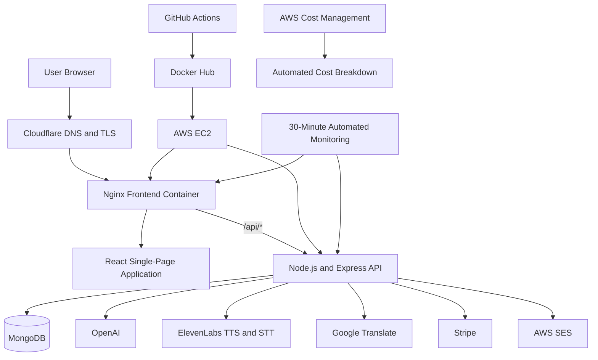
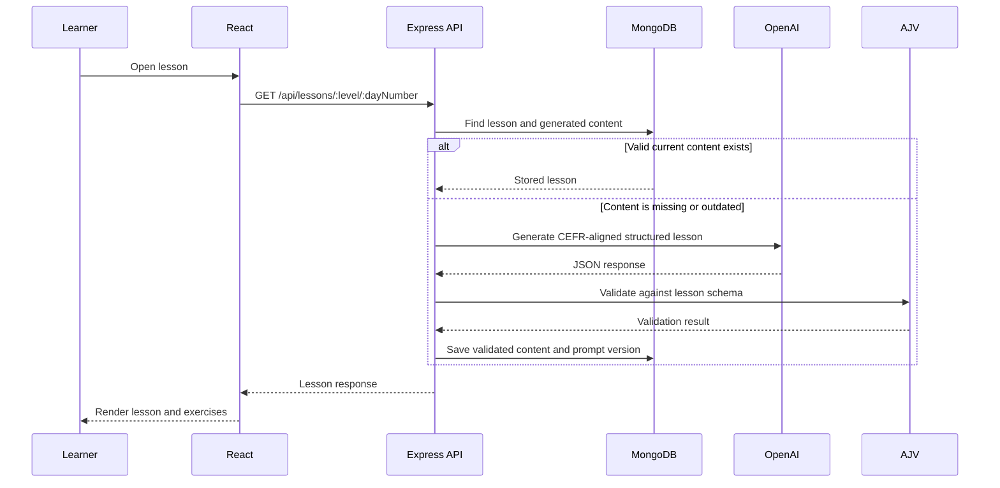

<div align="center">

# LanglyAI

### AI-powered French learning from A1 to B2

LanglyAI combines a structured CEFR-aligned curriculum with AI-generated explanations, bilingual examples, speaking practice, translation, progress tracking, and subscription-based access.

[](https://langlyai.com)
[](https://github.com/yashwantbist/LanglyAI/actions/workflows/deploy.yml)
[](https://github.com/yashwantbist/LanglyAI/actions/workflows/monitor.yml)

[Live Demo](https://langlyai.com) · [Report an Issue](https://github.com/yashwantbist/LanglyAI/issues) · [View Source](https://github.com/yashwantbist/LanglyAI)

</div>


---

## Overview

LanglyAI is a full-stack language-learning platform built to help learners progress through French levels **A1, A2, B1, and B2** using a guided curriculum rather than an unstructured chatbot experience.

The platform provides a **120-lesson learning path** with AI-generated bilingual content, examples, exercises, quizzes, speech features, translations, progress tracking, authentication, and paid subscription access.

The project was built as an end-to-end production application, including:

- Product design and frontend development
- REST API and database design
- AI content generation and validation
- Authentication and subscription management
- Third-party API integrations
- Docker containerization
- AWS cloud deployment
- CI/CD, health monitoring, and cloud-cost visibility

---

## Why I Built It

Many language-learning products fall into one of two categories:

1. Static lessons with limited personalization or interaction
2. Open-ended AI chat experiences without a structured learning path

LanglyAI combines the strengths of both. Learners follow a clear CEFR-aligned curriculum while receiving AI-generated explanations, bilingual examples, speaking support, exercises, and progress tracking.

---

## Core Features

### Structured French Curriculum

- 120 lessons across A1, A2, B1, and B2
- Daily lesson sequence with level-based navigation
- Protected access based on the learner's subscription plan
- Bilingual French and English learning content

### AI-Generated Lessons

- OpenAI-powered lesson generation
- CEFR-level prompting for appropriate vocabulary and complexity
- Structured explanations, key points, examples, exercises, quizzes, and tips
- JSON Schema output enforcement
- AJV validation before AI-generated content is saved
- Prompt versioning to support safe content regeneration

### Speech and Translation

- ElevenLabs text-to-speech for listening practice
- ElevenLabs speech-to-text for spoken responses
- Google Translate integration for contextual translation
- Audio processing through the backend to keep API credentials private

### Learner Progress

- Lesson completion tracking
- Score, accuracy, and time-spent fields
- Level-specific progress retrieval
- Persistent learner progress stored in MongoDB

### Authentication and Account Security

- Email and password registration
- Secure password hashing with bcrypt
- JWT-based authentication
- Google OAuth login
- Protected frontend routes
- Password reset emails through AWS SES
- Authenticated password-change workflow

### Subscription Management

- Stripe Checkout integration
- Stripe Customer Portal support
- Webhook-based subscription synchronization
- FREE, A1, A2, B1, and B2 access levels
- Subscription status and billing-period persistence
- Route-level entitlement checks

---

## System Architecture



### Request Flow

1. The user accesses `langlyai.com` through Cloudflare.
2. Nginx serves the compiled React application.
3. Requests beginning with `/api` are reverse-proxied to the Express backend.
4. The backend applies validation, authentication, subscription access rules, and business logic.
5. MongoDB stores users, lessons, progress, plans, and subscriptions.
6. External AI, voice, translation, payment, and email services are accessed only through the backend.

---

## Clean Architecture

LanglyAI currently uses a **modular layered architecture** within a full-stack monorepo.

### Presentation Layer

Located in `frontend/app/src`.

Responsibilities:

- React pages and reusable components
- Routing and protected routes
- Authentication state
- Lesson rendering
- User interactions and API requests

### API Layer

Located in `backend/routes`.

Responsibilities:

- HTTP endpoints
- Input handling
- Status codes and API responses
- Coordination between middleware, models, and external services

Primary route modules:

- `authroutes.js`
- `lessonroutes.js`
- `striperoutes.js`
- `voiceroutes.js`
- `translateroutes.js`

### Application and Domain Layer

Located across `backend/middleware`, curriculum data, validation schemas, and route-level services.

Responsibilities:

- Authentication rules
- Subscription entitlement checks
- Curriculum lookup
- AI prompt construction
- AI-output validation
- Progress updates
- Subscription synchronization

### Data Layer

Located in `backend/models` and `backend/config/database.js`.

Responsibilities:

- MongoDB connection management
- Mongoose schemas
- Persistent user, lesson, progress, plan, and subscription data

### Integration Layer

External services are isolated behind backend routes and configuration modules:

- OpenAI for lesson generation
- ElevenLabs for text-to-speech and speech-to-text
- Google Translate for translations
- Stripe for payments and subscriptions
- Google OAuth for social authentication
- AWS SES for transactional email

### Infrastructure Layer

- Docker images for frontend and backend
- Nginx for static hosting and API reverse proxying
- Docker Compose for container orchestration
- Docker Hub for image storage
- AWS EC2 for application hosting
- Cloudflare for domain routing and edge TLS
- GitHub Actions for CI/CD and scheduled monitoring
- AWS Cost Management for cloud-spend analysis

---

## Repository Structure

```text
LanglyAI/
├── .github/
│   └── workflows/
│       ├── deploy.yml          # Build, push, and deploy pipeline
│       └── monitor.yml         # Scheduled 30-minute health checks
├── backend/
│   ├── config/                 # Database, OAuth, and AWS SES configuration
│   ├── data/                   # Curriculum, blueprints, and JSON schemas
│   ├── middleware/             # Authentication and subscription access
│   ├── models/                 # Mongoose data models
│   ├── routes/                 # REST API modules
│   ├── Dockerfile
│   ├── package.json
│   └── server.js               # Express application entry point
├── frontend/
│   └── app/
│       ├── public/
│       ├── src/
│       │   ├── Components/
│       │   ├── Context/
│       │   └── Pages/
│       ├── Dockerfile
│       ├── nginx.conf
│       └── package.json
├── docker-compose.yml
└── README.md
```

---

## Technology Stack

| Area | Tools |
|---|---|
| Frontend | React, React Router, Axios, Tailwind CSS, React Markdown |
| Backend | Node.js, Express, JavaScript ES Modules |
| Database | MongoDB, Mongoose |
| AI | OpenAI, structured JSON output, prompt versioning |
| Validation | AJV, JSON Schema |
| Voice | ElevenLabs Text-to-Speech and Speech-to-Text |
| Translation | Google Cloud Translation API |
| Authentication | JWT, bcrypt, Passport, Google OAuth 2.0 |
| Payments | Stripe Checkout, Stripe Customer Portal, Stripe Webhooks |
| Email | AWS Simple Email Service |
| Infrastructure | AWS EC2, Docker, Docker Compose, Nginx, Cloudflare |
| CI/CD | GitHub Actions, Docker Hub, SSH deployment |
| Monitoring | Scheduled GitHub Actions health checks every 30 minutes |
| Cost Control | AWS Cost Management tools and automated cost breakdowns |

---

## AI Lesson Generation Pipeline



Important reliability decisions:

- AI output is requested as structured JSON instead of unrestricted text.
- AJV validates the response before persistence.
- Prompt versions are stored with generated content.
- Lessons can be regenerated when the content schema or prompt changes.
- External API keys remain on the server.

---

## Deployment and CI/CD

Every push to the `main` branch starts the deployment workflow.

```text
Push to main
   ↓
GitHub Actions checks out the repository
   ↓
Build backend and frontend Docker images
   ↓
Push images to Docker Hub
   ↓
Copy Docker Compose configuration to AWS EC2
   ↓
Connect to EC2 through SSH
   ↓
Pull latest images and restart containers
   ↓
Run frontend and backend health checks
   ↓
Remove unused Docker images
```

### Production Containers

- **Frontend:** Multi-stage React build served by Nginx on port 80
- **Backend:** Node.js and Express API on port 5000
- **Nginx:** Serves the SPA and proxies `/api/*` requests to the backend container
- **Docker Compose:** Manages container startup, restart policies, environment files, networking, and health checks

---

## Monitoring and Cost Management

LanglyAI includes a scheduled GitHub Actions workflow that runs every **30 minutes** and checks the frontend and backend health endpoints.

When a scheduled workflow fails, GitHub workflow notifications provide an email-based operational alert so issues can be investigated quickly.

AWS Cost Management tools are also used to review infrastructure spending and produce automated cost breakdowns. This helps identify unexpected usage and supports better decisions as the platform grows.

Planned monitoring improvements include centralized logs, request metrics, error tracking, uptime history, and alert severity levels.

---

## Local Development

### Prerequisites

- Node.js 18 or newer
- npm
- MongoDB or MongoDB Atlas
- Accounts and API credentials for the integrations you want to test

### 1. Clone the Repository

```bash
git clone https://github.com/yashwantbist/LanglyAI.git
cd LanglyAI
```

### 2. Configure the Backend

```bash
cd backend
npm install
```

Create `backend/.env`:

```env
PORT=5000
NODE_ENV=development

MONGO_URI=your_mongodb_connection_string
JWT_SECRET=your_jwt_secret
SESSION_SECRET=your_session_secret

FRONTEND_URL=http://localhost:3000
CLIENT_URL=http://localhost:3000

OPENAI_API_KEY=your_openai_api_key

ELEVENLABS_API_KEY=your_elevenlabs_api_key
ELEVENLABS_DEFAULT_VOICE_ID=your_default_voice_id

GOOGLE_TRANSLATE_API_KEY=your_google_translate_api_key

CLIENT_ID=your_google_oauth_client_id
CLIENT_SECRET=your_google_oauth_client_secret
GOOGLE_CALLBACK_URL=http://localhost:5000/api/auth/google/callback

STRIPE_SECRET_KEY=your_stripe_secret_key
STRIPE_WEBHOOK_SECRET=your_stripe_webhook_secret

AWS_REGION=your_aws_region
AWS_ACCESS_KEY_ID=your_aws_access_key_id
AWS_SECRET_ACCESS_KEY=your_aws_secret_access_key
EMAIL_FROM=no-reply@your-domain.com
```

Start the backend:

```bash
npm run dev
```

### 3. Configure the Frontend

Open a second terminal:

```bash
cd frontend/app
npm install
npm start
```

The local applications will normally be available at:

- Frontend: `http://localhost:3000`
- Backend: `http://localhost:5000`

> Never commit `.env` files, private keys, Stripe secrets, AWS credentials, or third-party API keys.

---

## Main API Areas

| Base Route | Purpose |
|---|---|
| `/api/auth` | Registration, login, profile, Google OAuth, and password management |
| `/api/lessons` | Curriculum, AI lesson generation, and progress tracking |
| `/api/voice` | Text-to-speech and speech-to-text |
| `/api/translate` | Translation requests |
| `/api/stripe` | Checkout, billing portal, subscription synchronization, and webhooks |

---

## Roadmap: What Comes Next

### Next Priority: AI Evaluation and Quality Dashboard

The next major feature is an evaluation pipeline that will automatically assess generated lessons for:

- CEFR-level alignment
- Factual and grammatical accuracy
- French and English meaning consistency
- Duplicate or overly similar content
- Required-section completeness
- Exercise and quiz validity
- Learner completion, score, and accuracy signals

The evaluation results will be shown in an internal quality dashboard and used to identify weak lessons, compare prompt versions, and improve future generation.

### Product Roadmap

- [ ] Build the AI lesson evaluation and QA pipeline
- [ ] Add an internal content-quality and prompt-performance dashboard
- [ ] Add pronunciation scoring and targeted speaking feedback
- [ ] Introduce adaptive lesson recommendations based on learner performance
- [ ] Add spaced repetition for vocabulary and grammar review
- [ ] Add teacher or administrator content-review workflows
- [ ] Improve accessibility and keyboard navigation
- [ ] Add end-to-end tests for authentication, lessons, and Stripe flows
- [ ] Add centralized logging, error tracking, and performance metrics
- [ ] Add Redis caching and background job processing for AI generation
- [ ] Add rollback and zero-downtime deployment support
- [ ] Evaluate Kubernetes or AWS ECS as usage grows

---

## Engineering Lessons Demonstrated

LanglyAI is more than an API wrapper. The project demonstrates experience with:

- Turning a product idea into a deployed full-stack application
- Designing REST APIs and MongoDB data models
- Building reliable AI-generation workflows with schemas and validation
- Managing authentication and subscription-based access
- Integrating payment, email, voice, translation, and OAuth providers
- Debugging CORS, Nginx, Docker, Stripe webhook, and cloud-deployment issues
- Building automated CI/CD and production-monitoring workflows
- Managing cloud costs and operational reliability
- Iterating from rough prototype to a maintainable production system

---

## Author

**Yashwant Bist**

- Portfolio: [yashwant-bist.netlify.app](https://yashwant-bist.netlify.app/)
- LinkedIn: [linkedin.com/in/yashwant-bist](https://www.linkedin.com/in/yashwant-bist)
- GitHub: [github.com/yashwantbist](https://github.com/yashwantbist)

---

<div align="center">

Built to explore how structured curriculum, reliable AI generation, and production engineering can work together to create a more useful language-learning experience.

</div>
